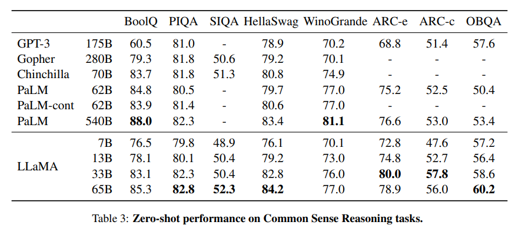

# LLAMA Datasets

## Common Sense Reasoning
----------------------------
### BoolQ
- 论文标题：
- 论文地址：
- 下载：[huggingface-boolq](https://huggingface.co/datasets/boolq)
  
### PIQA
- 论文标题：
- 论文地址：
- 下载：[huggingface-piqa](https://huggingface.co/datasets/piqa)

### SIQA
- 论文标题：
- 论文地址：
- 下载：[huggingface-siqa](https://huggingface.co/datasets/social_i_qa)
  
### HellaSwag
- 论文标题：
- 论文地址：
- 下载：[huggingface-hellaswag](https://huggingface.co/datasets/hellaswag)
  
### ARC-e & ARC-c
- 论文标题：
- 论文地址：
- 下载：[huggingface-ARC](https://huggingface.co/datasets/ai2_arc)
  
### OBQA
- 论文标题：
- 论文地址：
- 下载：[huggingface-obqa](https://huggingface.co/datasets/openbookqa)
  

##  Closed-book Question Answering
-------------------------------------
### Natural Questions
- 论文标题：
- 论文地址：
- 下载：[huggingface-naturalquestions](https://huggingface.co/datasets/natural_questions)

### TriviaQA
- 论文标题：
- 论文地址：
- 下载：[huggingface-triviaQA](https://huggingface.co/datasets/natural_questions)
  
## Reading Comprehension
-----------------------------------
### RACE
- 论文标题
- 论文地址
- 下载：[huggingface-RACE](https://huggingface.co/datasets/race)
  
## Mathematical reasoning
-----------------------------------------
### MATH
- 论文标题
- 论文地址
- 下载：[github-MATG](https://github.com/hendrycks/math)
  
### GSM8k
- 论文标题
- 论文地址
- 下载：[huggingface-GSM8K](https://github.com/hendrycks/math)
  
## Code generation 
-----------------------------------
### HumanEval
- 论文标题
- 论文地址
- 下载：[huggingface-humaneval](https://huggingface.co/datasets/openai_humaneval)

### MBPP
- 论文标题
- 论文地址
- 下载：[huggingface-MBPP](https://huggingface.co/datasets/mbpp)

## Massive Multitask Language Understanding
---------------------------------------------------------------
### MMLU

- 论文标题
- 论文地址
- 下载：[huggingface-MMLU](https://huggingface.co/datasets/lighteval/mmlu)
