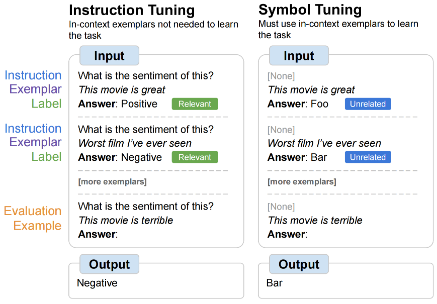

# SYMBOL TUNING IMPROVES IN-CONTEXT LEARNING IN LANGUAGE MODELS

## 一些前提
- 首先，本文的所有实验以及思路仅针对LLM使用ICL做NLP任务上的classification任务。
- 通过这种方法，模型会显著提高没有instruction以及没有正确标签下的ICL能力，有更强的依据上下文的推理能力。并且也会一定程度上提高有instruction有正确标签的推理能力。并且越大的模型越明显。
- symbol-tuning下的模型在处理algorithmic reasoning tasks的问题上的提升会更加显著。
- 该方法的使用仅需要在下游数据上finetune 1k-2k step 即可让模型获得更强的ICL能力。
  
## Method

- 原有的ICL方法是，给定instruction，给定example，让模型预测标签。这里的标签是有意义的标签，比如情感分类，postive样本的标签就应该预测为positive。
- 该方法认为，可以用unrelated标签代替原本的related标签，以这样的方式finetune模型，希望模型不要再学习到一些语言知识，而是单纯的学习如何从in-context样本中找到规律，即便这个规律是与语言知识相反的。从而完全依赖ICL能力去做分类。
- 我个人的理解是，对于人来说，你让他去做情感分类，你给他演示的例子中，所有的负向句子的标签都是positive，正向句子都是negative，那么你给他一个正向的句子，他也应该知道要分类到positive。
- 所以通过这种将标签无关化，仅作为ICL的symbol的方式，可以强化模型的ICL能力。希望模型在ICL的时候更多的凭借理解上下文之间的规律，而不是过分依赖于知识。

