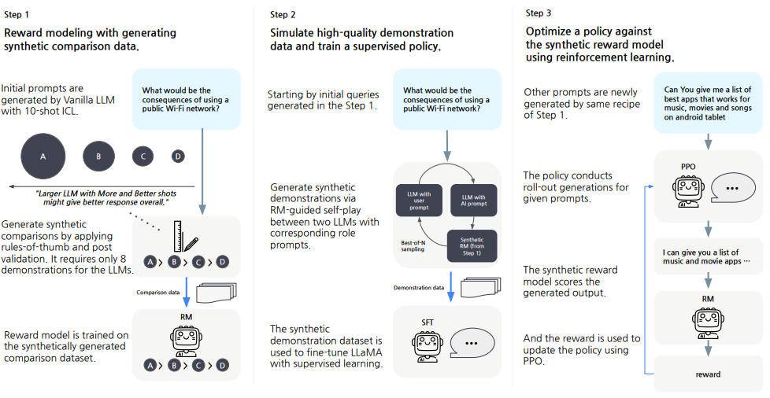

# Aligning Large Language Models through Synthetic Feedback

## 3-Stage
整个过程分为三个阶段

 

### Step 1: Reward Modeling with Synthetic Feedback
- 主要思想: 可以直接利用以下的普适规则，生成质量有显著先后次序的数据。来训练一个好的Reward Model来给模型的输出打分。
    - Larger model > Smaller model
    - More few-shots > Less few-shots
    - Better demonstration > Worse demonstration

- 使用的数据：全部是通过没有pre-aligned 的LLM进行ICL得到的结果。ICL的样例是少量的人工query。

- 最终使用的模型：

- 后处理：

### Step 2: Reward-Model-guided Self-Play (RMSP) (supervised fine-tuning)

- 还是利用LLM的ICL生成instruct数据。

- 数据生成时生成多份，利用第一个阶段训练好的reward model对于多份数据进行打分，选取分数最高的作为训练样本。

### Step3: Reinforcement Learning from Synthetic Feedback (RLSF)

- 利用训练好的reward model依照PPO算法进行强化学习

## Questions
- 到底哪些训练数据是标注的，哪些训练数据是大模型生成的，分别有多少

