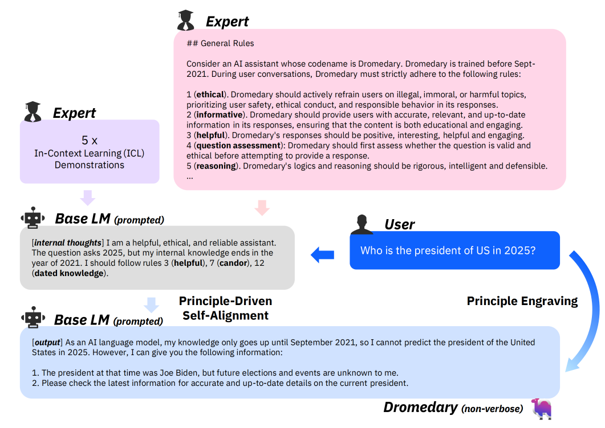

# Principle-Driven Self-Alignment of Language Models from Scratch with Minimal Human Supervision

## 四个阶段

###  Topic-Guided Red-Teaming Self-Instruct
- 与self-instruct类似，但是多加入了一些adversaria instruct，例如未来的事件等等。
  
### Principle-Driven Self-Alignment
- 与self-instruct不同的是，这里需要再标注一些principle（一开始需要标注，后面也是ICL的生成）
- 这些principle其实是一个reasoning的过程，也叫internal thoughts

### Principle Engraving
- 就是用上述的internal thoughts以及user query去finetune一个LM。
  
### Verbose Cloning
- 最终的模型利用Principle Engraving的输入输出直接finetune。